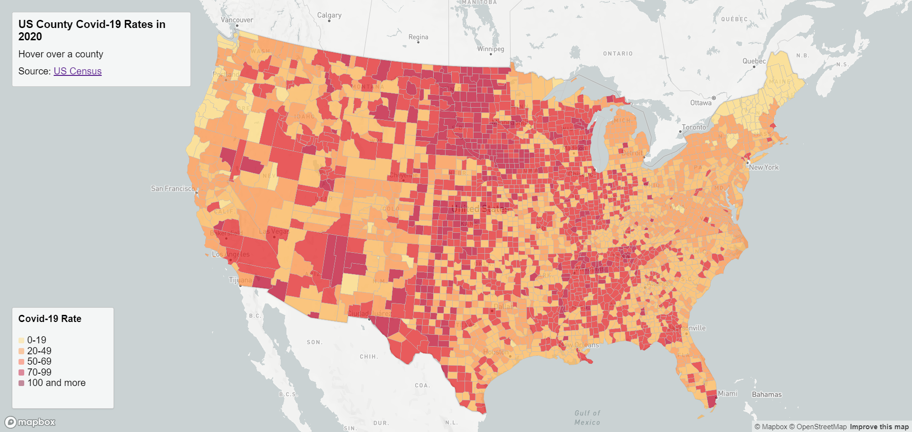
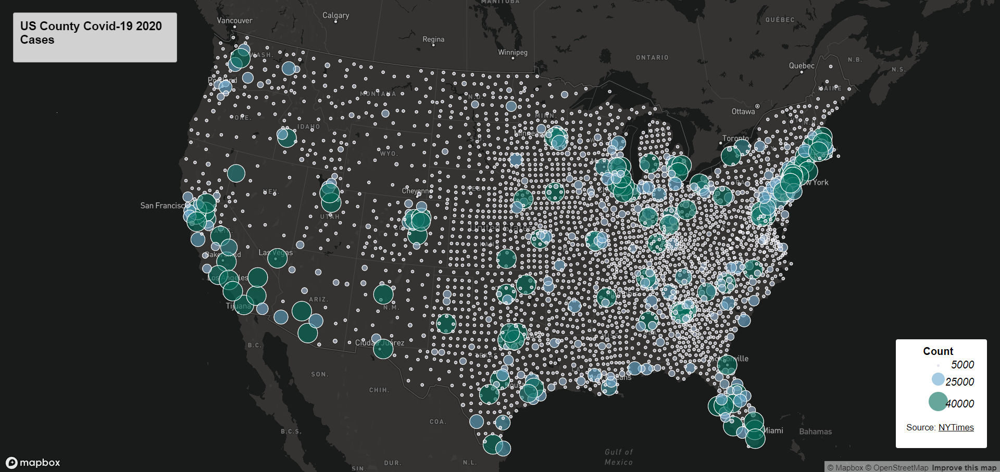

# 2020 US Covid-19 Maps
Lizeth Velderrain-Lopez
GEOG 458 AA

This project consists of two maps depicting different effects of Covid-19 during the peak pandemic of 2020 in the United States. Both maps show data collected at the county level. The [first map](https://lizethvl.github.io/us-covid-maps-2020/map1.html) uses the Covid-19 rates of each county in a choropleth map. The Covid-19 rate for each county can be seen by hovering over the respective county, while also being visualized through the choropleth categories. The [second map](https://lizethvl.github.io/us-covid-maps-2020/map2.html) depicts the case count of Covid-19 using a proportional symbols map for each county. To find each county's specific case count, click on the correspoding circle to bring up a popup with the information.
The data used for the maps come from the [NY Times](https://github.com/nytimes/covid-19-data/blob/43d32dde2f87bd4dafbb7d23f5d9e878124018b8/live/us-counties.csv) for the case/count data, the US Census to calculate the actual rate from the [2018 ACS 5 year estimates](https://data.census.gov/table/ACSDP5Y2018.DP05?g=0100000US$050000&d=ACS%205-Year%20Estimates%20Data%20Profiles&hidePreview=true), and the US Census Bureau also provided the [shapefile data](https://www.census.gov/geographies/mapping-files/time-series/geo/carto-boundary-file.html) used for the first map.
In order to project this data onto the Albers projection and to simplify the shapefile data, [mapshaper](https://mapshaper.org/) was used. Both maps also utilize [Mapbox](https://www.mapbox.com/) for the general theme and basemap.